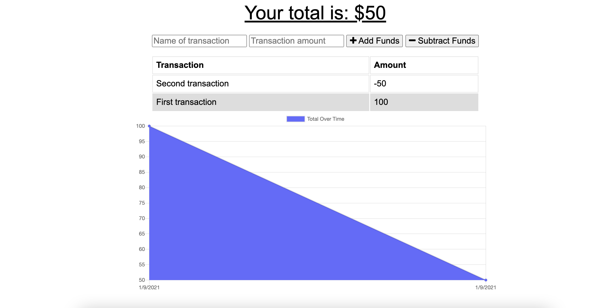

# Progressive Budget Tracker

## Description
This application allows the user to track their income and expenses while being both online and offline. If a user is offline, the transaction will be stored in a front-end database and added to the MongoDB database when the user comes back online.

## Table of Contents
* [Deployed App](#deployed-app)

* [Screenshots](#screenshots)

* [Installation](#installation)

* [Questions](#questions)

## Deployed App
https://warm-sierra-46325.herokuapp.com/

## Screenshots

## Installation
npm install

## License
This application is covered under the MIT license.

## Questions
My GitHub: https://github.com/grahamelphick

If you have any further questions, you can reach me at: graham.m.elphick@gmail.com